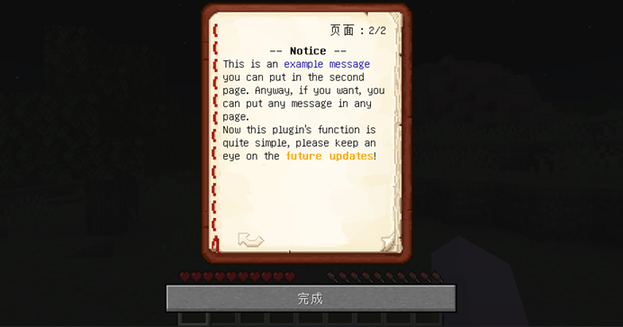

# BookScoreBoard
A Minecraft Spigot plugin, keep scoreboard in a book.

## Introduction

Do you hate that the traditional scoreboard occupied a large space at the right hand side of the screen? it's not only ugly but also blocks players' view, especially on a small size monitor (eg. a laptop). 

BookScoreBook let you have another choice: to **keep the scoreboard or other information in a book**, and players can use command to open their book scoreboard or read the information. These books are simply created in a void item stack and **will not appear in the players' inventory**. In sum, this plugin currently has the following features:

- Players can type command to open a book scoreboard.
- Book's content is fully configurable
- Support **PlaceHolderAPI**
- Support multi-pages
- Support chat colors (originally)


## Screenshots





## Usage

### Installation

- Drag to the **plugins** folder
- Soft depend on **PlaceHolderAPI**
- Please **fully test before use**. If you encounter any problem, please send me feedback

### Configuration

Very easy to understand, see the above screenshots as the outcome：

```yaml
enable: true
# all of the following sections support PlaceHolder
book-title: "Book Score Book"
book-author: "%player_name%"
page-1:
  - "    §l-- Score Board -- "
  - "§0Hi, §6§l%player_name%§0. Here's your info:"
  - "§0Your Group: §1§l%player_group%"
  - "§0Your Team: §5§l%player_team%"
  - "§0Your Level: §2§l%player_level%"
  - "§0Your Exp: §2§l%player_exp%"
  - "§0Your Money: §2§l%player_money%"
  - "§0Your IP: §4§l%player_ip%"
  - "§0Your Ping: §4§l%player_ping%"
  - "§0§lHave a nice day! ^_^ "
page-2:
  - "        §l-- Notice -- "
  - "§0This is an §1example message §0you can put in the second page. Anyway, if you want, you can put any message in any page."
  - "Now this plugin's function is quite simple, please keep an eye on the §6§lfuture updates§0!"


```

### Permissions

```shell
# can the players open the book scoreboard? 
# default: true
bsb.open

# permission to reload the config by command
# default: op
bsb.reload
```

### Commands

```shell
# player open the book scoreboard
bsb-open

# reload the plugin
bsb-reload
```


## Future plans

The functionalities of BookScoreBoard is currently very simple, please keep an eye on the future updates. Future plans include but are not limited at:

- Bugs detections
- Performance optimization
- Customizable open book command
- Some open book hot keys
- More special effects and links in book scoreboard
- Server command to open the book for groups of player
- Etc.
